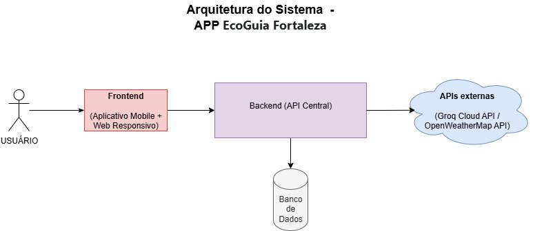

# Arquitetura do Sistema – App EcoGuia Fortaleza 🌱

## 1. Visão Geral da Arquitetura
A arquitetura do **App EcoGuia Fortaleza** é baseada no modelo **Cliente-Servidor**. O sistema foi projetado com foco na acessibilidade universal via web, garantindo que o software seja escalável e modular.

O sistema é composto por três camadas principais:
* **Camada de Clientes (Frontend):** Responsável pela interface com o usuário. Trata-se de uma aplicação Web Responsiva desenvolvida em **React.js**, acessível via navegador em desktops e dispositivos móveis.
* **Camada de Servidor (Backend):** Atua como o cérebro do sistema, processando a lógica de negócio, gerenciando as requisições e orquestrando as interações com o banco de dados.
* **Camada de Dados:** Responsável pelo armazenamento e persistência das informações do sistema, além de integrar com APIs de terceiros.

---

## 2. Componentes e Tecnologias

### 2.1. Frontend (Camada de Clientes)
O frontend concentra-se na experiência do usuário através de uma interface moderna e adaptável.
* **Tecnologia Principal:** **React.js**.
* **Formato:** Aplicação Web Responsiva (SPA - Single Page Application).
* **Abrangência:** O layout adapta-se automaticamente a diferentes resoluções, permitindo o uso fluido tanto em computadores quanto em smartphones (Android/iOS) sem necessidade de instalação via loja de aplicativos.

### 2.2. Backend (Camada de Servidor)
O backend é uma **API RESTful central**, servindo como ponto único de comunicação.
* **Padrão Arquitetural:** Cliente-Servidor. O frontend envia requisições HTTP para a API, que processa e retorna JSON.
* **Principais Funções:**
    * Gerenciamento de usuários (cadastro, login).
    * Lógica de negócio para resíduos e jardinagem.
    * Integração com APIs externas.
    * Autenticação e segurança.

### 2.3. Camada de Dados
A camada de dados gerencia a persistência e serviços externos.
* **Banco de Dados:** Banco relacional para armazenar perfis, pontos de coleta e guia de plantas.
* **APIs Externas:**
    * **Groq Cloud API:** Para o chatbot/assistente virtual.
    * **OpenWeatherMap API:** Para dados climáticos na jardinagem.

---

## 3. Diagrama de Arquitetura
Abaixo está a representação visual da arquitetura implementada:

> *Nota: O diagrama ilustra o fluxo de dados entre a Aplicação Web (React), a API e os serviços externos.*

---

## 4. Decisões Técnicas e Justificativas

### Escolha por Web Responsiva com React.js
**Justificativa:** Optou-se por focar exclusivamente em uma aplicação web responsiva em vez de um app nativo para garantir **acessibilidade imediata**. O uso do **React.js** permite criar uma interface dinâmica e rápida (SPA) que funciona em qualquer dispositivo com navegador, facilitando a distribuição (basta um link) e agilizando o ciclo de desenvolvimento e atualizações.

### Arquitetura Cliente-Servidor
**Justificativa:** Essa separação permite que o frontend (React) e o backend evoluam de forma independente. O backend pode receber melhorias de performance sem que seja necessário alterar o código da interface do usuário.

### Uso de APIs Externas (Groq e OpenWeatherMap)
**Justificativa:** A integração economiza recursos de desenvolvimento. A **Groq Cloud** oferece processamento rápido para o assistente virtual, e a **OpenWeatherMap** garante dados climáticos precisos para as funcionalidades de plantio, enriquecendo a experiência do usuário sem custo elevado de implementação.
