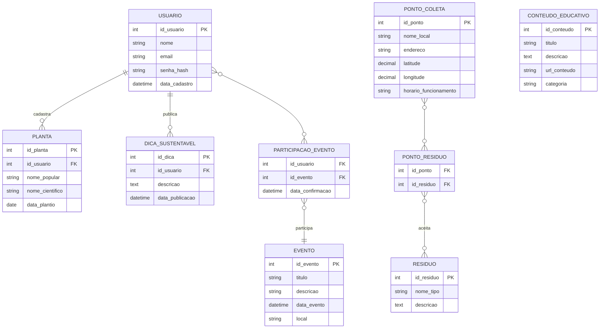

# Modelo de Dados – App Sustentável Fortaleza 🌱

## 1\. Introdução

Este documento descreve o **modelo de dados** do **App Sustentável Fortaleza**. Ele detalha as tabelas, os campos, os tipos de dados e os relacionamentos do banco de dados. O objetivo é criar uma base sólida para as funcionalidades do aplicativo, como cadastro de usuários, pontos de coleta, dicas de jardinagem e eventos comunitários.

-----

## 2\. Visão Geral das Entidades

Nosso banco de dados será composto pelas seguintes tabelas principais:

  * **`Usuario`**: Armazena as informações de quem usa o app.
  * **`PontoColeta`**: Guarda os dados dos locais de descarte de resíduos.
  * **`Residuo`**: Lista os tipos de lixo que podem ser reciclados.
  * **`Planta`**: Contém os registros das plantas que cada usuário cadastra.
  * **`DicaSustentavel`**: Armazena as dicas que os usuários compartilham.
  * **`Evento`**: Guarda as informações de eventos comunitários.
  * **`ParticipacaoEvento`**: Uma tabela auxiliar para registrar quais usuários participam de quais eventos.
  * **`ConteudoEducativo`**: Armazena os artigos e vídeos educativos.
  * **`PontoResiduo`**: Uma tabela auxiliar que conecta pontos de coleta com os tipos de resíduos que eles aceitam.

-----

## 3\. Detalhamento das Entidades (Tabelas)

Aqui, cada tabela é descrita com seus campos (atributos), indicando a chave primária (`PK`), as chaves estrangeiras (`FK`) e os tipos de dados.

### `Usuario`

  * **Para que serve:** Armazena os dados básicos dos usuários do aplicativo.
  * **Campos:**
      * `id_usuario` (PK): `INT` - Identificador único de cada usuário.
      * `nome`: `VARCHAR(100)` - Nome completo do usuário.
      * `email`: `VARCHAR(150)` - E-mail do usuário. Usado para login.
      * `senha_hash`: `VARCHAR(255)` - Senha criptografada por segurança.
      * `data_cadastro`: `DATETIME` - Data e hora em que o usuário se registrou.

### `PontoColeta`

  * **Para que serve:** Armazena a localização e informações dos ecopontos e outros pontos de descarte.
  * **Campos:**
      * `id_ponto` (PK): `INT` - Identificador único do ponto de coleta.
      * `nome_local`: `VARCHAR(100)` - Nome do local (ex.: "Ecoponto Parangaba").
      * `endereco`: `VARCHAR(255)` - Endereço completo.
      * `latitude`: `DECIMAL(10, 8)` - Coordenada geográfica (para mapas).
      * `longitude`: `DECIMAL(11, 8)` - Coordenada geográfica (para mapas).
      * `horario_funcionamento`: `VARCHAR(255)` - Horário de atendimento.

### `Residuo`

  * **Para que serve:** Lista os tipos de resíduos que o aplicativo gerencia.
  * **Campos:**
      * `id_residuo` (PK): `INT` - Identificador único do tipo de resíduo.
      * `nome_tipo`: `VARCHAR(50)` - Nome do resíduo (ex.: "Plástico", "Vidro", "Pilhas").
      * `descricao`: `TEXT` - Descrição detalhada sobre como reciclar o material.

### `Planta`

  * **Para que serve:** Permite que os usuários registrem e acompanhem suas plantas.
  * **Campos:**
      * `id_planta` (PK): `INT` - Identificador único da planta.
      * `id_usuario` (FK): `INT` - Relaciona a planta ao seu dono (chave estrangeira para `Usuario`).
      * `nome_popular`: `VARCHAR(100)` - Nome comum da planta.
      * `nome_cientifico`: `VARCHAR(100)` - Nome científico da planta.
      * `data_plantio`: `DATE` - Data em que a planta foi cultivada.

### `DicaSustentavel`

  * **Para que serve:** Armazena as dicas compartilhadas pela comunidade.
  * **Campos:**
      * `id_dica` (PK): `INT` - Identificador único da dica.
      * `id_usuario` (FK): `INT` - Relaciona a dica ao usuário que a publicou.
      * `descricao`: `TEXT` - Conteúdo da dica.
      * `data_publicacao`: `DATETIME` - Data e hora da publicação.

### `Evento`

  * **Para que serve:** Guarda informações sobre os eventos comunitários.
  * **Campos:**
      * `id_evento` (PK): `INT` - Identificador único do evento.
      * `titulo`: `VARCHAR(150)` - Título do evento.
      * `descricao`: `TEXT` - Descrição detalhada.
      * `data_evento`: `DATETIME` - Data e hora de início do evento.
      * `local`: `VARCHAR(255)` - Endereço ou descrição do local do evento.

### `ConteudoEducativo`

  * **Para que serve:** Armazena o material educativo do aplicativo.
  * **Campos:**
      * `id_conteudo` (PK): `INT` - Identificador único do conteúdo.
      * `titulo`: `VARCHAR(150)` - Título do artigo ou vídeo.
      * `descricao`: `TEXT` - Resumo do conteúdo.
      * `url_conteudo`: `VARCHAR(255)` - Link para o conteúdo externo (vídeo, artigo).
      * `categoria`: `VARCHAR(50)` - Categoria do conteúdo (ex.: "Reciclagem", "Compostagem").

-----

## 4\. Tabelas de Relacionamento (N:N)

Essas tabelas são necessárias para gerenciar relacionamentos complexos, onde um item se conecta a vários outros, e vice-versa.

### `PontoResiduo`

  * **Para que serve:** Conecta a tabela `PontoColeta` com a tabela `Residuo`. Isso permite que um ponto de coleta aceite vários tipos de resíduos e que um tipo de resíduo seja aceito em vários pontos de coleta.
  * **Campos:**
      * `id_ponto` (FK): `INT`
      * `id_residuo` (FK): `INT`
      * **Observação:** A chave primária dessa tabela é a combinação de `id_ponto` e `id_residuo`.

### `ParticipacaoEvento`

  * **Para que serve:** Conecta a tabela `Usuario` com a tabela `Evento`. Permite registrar a presença de um usuário em vários eventos e saber quais usuários participam de um evento específico.
  * **Campos:**
      * `id_usuario` (FK): `INT`
      * `id_evento` (FK): `INT`
      * `data_confirmacao`: `DATETIME` - Data e hora em que o usuário confirmou a presença.
      * **Observação:** A chave primária dessa tabela é a combinação de `id_usuario` e `id_evento`.

-----

## 5\. Diagrama Entidade-Relacionamento (DER)

Este diagrama visualiza a estrutura do banco de dados, mostrando as tabelas e como elas se conectam.

