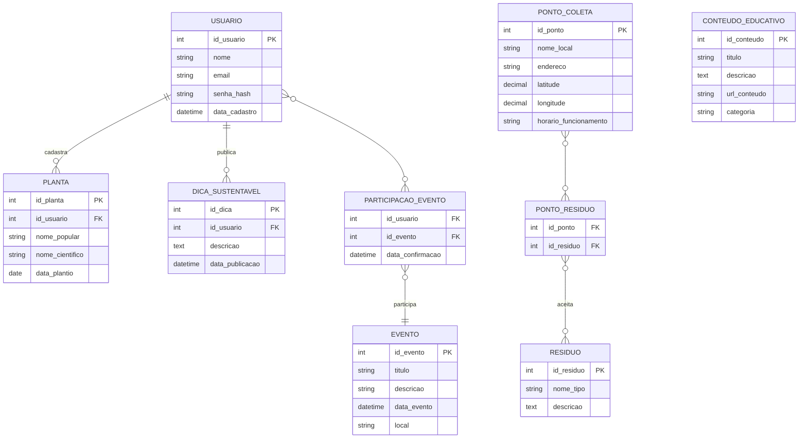

# Modelo de Dados – App Sustentável Fortaleza 🌱

## 1\. Introdução

Este documento detalha o **modelo de dados** do **App Sustentável Fortaleza**. Ele descreve as tabelas, os campos, os tipos de dados e os relacionamentos do banco de dados. O objetivo é criar uma base sólida para as funcionalidades do aplicativo, como cadastro de usuários, gestão de resíduos e engajamento comunitário.

-----

## 2\. Visão Geral das Entidades

O banco de dados será composto pelas seguintes tabelas principais:

  * **`Usuario`**: Armazena as informações de quem usa o app.
  * **`PontoColeta`**: Guarda os dados dos locais de descarte de resíduos.
  * **`Residuo`**: Lista os tipos de lixo que podem ser reciclados.
  * **`Planta`**: Contém os registros das plantas que cada usuário cadastra.
  * **`DicaSustentavel`**: Armazena as dicas que os usuários compartilham.
  * **`Evento`**: Guarda as informações de eventos comunitários.
  * **`ConteudoEducativo`**: Armazena os artigos e vídeos educativos.
  * **`PontoResiduo`**: Tabela auxiliar para conectar pontos de coleta com tipos de resíduos.
  * **`ParticipacaoEvento`**: Tabela auxiliar para registrar a presença de usuários em eventos.

-----

## 3\. Detalhamento das Entidades e Relacionamentos

Aqui, cada tabela é descrita com seus campos e relacionamentos.

### `Usuario`

  * **Para que serve:** Armazena os dados básicos dos usuários.
  * **Relacionamentos:**
      * Um usuário **pode cadastrar** várias **plantas** (1:N).
      * Um usuário **pode publicar** várias **dicas sustentáveis** (1:N).
      * Um usuário **pode participar** de vários **eventos** (N:N, via `ParticipacaoEvento`).

### `PontoColeta`

  * **Para que serve:** Armazena a localização e informações dos ecopontos e outros pontos de descarte.
  * **Relacionamentos:**
      * Um ponto de coleta **pode aceitar** vários **tipos de resíduos** (N:N, via `PontoResiduo`).

### `Residuo`

  * **Para que serve:** Lista os tipos de resíduos que o aplicativo gerencia.
  * **Relacionamentos:**
      * Um tipo de resíduo **pode ser aceito** em vários **pontos de coleta** (N:N, via `PontoResiduo`).

### `Planta`

  * **Para que serve:** Permite que os usuários registrem e acompanhem suas plantas.
  * **Relacionamentos:**
      * Uma planta **pertence a** um único **usuário** (N:1).

### `DicaSustentavel`

  * **Para que serve:** Armazena as dicas compartilhadas pela comunidade.
  * **Relacionamentos:**
      * Uma dica **pertence a** um único **usuário** (N:1).

### `Evento`

  * **Para que serve:** Guarda informações sobre os eventos comunitários.
  * **Relacionamentos:**
      * Um evento **pode ter** vários **participantes** (N:N, via `ParticipacaoEvento`).

### `ConteudoEducativo`

  * **Para que serve:** Armazena o material educativo do aplicativo.
  * **Relacionamentos:**
      * Não possui relacionamentos diretos com outras tabelas.

-----

### 4\. Dicionário de Dados

Esta seção detalha cada campo das tabelas, especificando o tipo de dado e as restrições.

#### **Tabela: `Usuario`**

| Campo | Tipo de Dado | Restrições | Descrição |
| :--- | :--- | :--- | :--- |
| `id_usuario` | `INT` | PK, AUTO\_INCREMENT | Identificador único do usuário. |
| `nome` | `VARCHAR(100)` | NOT NULL | Nome completo do usuário. |
| `email` | `VARCHAR(150)` | NOT NULL, UNIQUE | E-mail do usuário. Usado como login. |
| `senha_hash` | `VARCHAR(255)` | NOT NULL | Senha criptografada por segurança. |
| `data_cadastro` | `DATETIME` | NOT NULL | Data e hora em que o usuário se registrou. |

#### **Tabela: `PontoColeta`**

| Campo | Tipo de Dado | Restrições | Descrição |
| :--- | :--- | :--- | :--- |
| `id_ponto` | `INT` | PK, AUTO\_INCREMENT | Identificador único do ponto de coleta. |
| `nome_local` | `VARCHAR(100)` | NOT NULL | Nome do local (ex.: Ecoponto, Ponto de Coleta). |
| `endereco` | `VARCHAR(255)` | | Endereço completo do ponto. |
| `latitude` | `DECIMAL(10, 8)` | NOT NULL | Coordenada geográfica para localização no mapa. |
| `longitude` | `DECIMAL(11, 8)` | NOT NULL | Coordenada geográfica para localização no mapa. |
| `horario_funcionamento`| `VARCHAR(255)` | | Horário de atendimento (texto livre). |

#### **Tabela: `Residuo`**

| Campo | Tipo de Dado | Restrições | Descrição |
| :--- | :--- | :--- | :--- |
| `id_residuo` | `INT` | PK, AUTO\_INCREMENT | Identificador único do tipo de resíduo. |
| `nome_tipo` | `VARCHAR(50)` | NOT NULL | Nome do resíduo (ex.: Plástico, Óleo, Vidro). |
| `descricao` | `TEXT` | | Descrição detalhada sobre o material e seu descarte. |

#### **Tabela: `Planta`**

| Campo | Tipo de Dado | Restrições | Descrição |
| :--- | :--- | :--- | :--- |
| `id_planta` | `INT` | PK, AUTO\_INCREMENT | Identificador único da planta. |
| `id_usuario` | `INT` | FK, NOT NULL | Chave estrangeira para `Usuario`. Relaciona a planta ao seu dono. |
| `nome_popular` | `VARCHAR(100)` | NOT NULL | Nome comum da planta. |
| `nome_cientifico` | `VARCHAR(100)` | | Nome científico da planta (opcional). |
| `data_plantio` | `DATE` | | Data em que a planta foi plantada. |

#### **Tabela: `DicaSustentavel`**

| Campo | Tipo de Dado | Restrições | Descrição |
| :--- | :--- | :--- | :--- |
| `id_dica` | `INT` | PK, AUTO\_INCREMENT | Identificador único da dica. |
| `id_usuario` | `INT` | FK, NOT NULL | Chave estrangeira para `Usuario`. Relaciona a dica ao seu autor. |
| `descricao` | `TEXT` | NOT NULL | Conteúdo da dica sustentável. |
| `data_publicacao` | `DATETIME` | NOT NULL | Data e hora da publicação. |

#### **Tabela: `Evento`**

| Campo | Tipo de Dado | Restrições | Descrição |
| :--- | :--- | :--- | :--- |
| `id_evento` | `INT` | PK, AUTO\_INCREMENT | Identificador único do evento. |
| `titulo` | `VARCHAR(150)` | NOT NULL | Título do evento. |
| `descricao` | `TEXT` | NOT NULL | Descrição detalhada do evento. |
| `data_evento` | `DATETIME` | NOT NULL | Data e hora de início do evento. |
| `local` | `VARCHAR(255)` | NOT NULL | Endereço ou nome do local. |

#### **Tabela: `ConteudoEducativo`**

| Campo | Tipo de Dado | Restrições | Descrição |
| :--- | :--- | :--- | :--- |
| `id_conteudo` | `INT` | PK, AUTO\_INCREMENT | Identificador único do conteúdo. |
| `titulo` | `VARCHAR(150)` | NOT NULL | Título do artigo ou vídeo. |
| `descricao` | `TEXT` | | Descrição ou resumo do conteúdo. |
| `url_conteudo` | `VARCHAR(255)` | | URL para o conteúdo (vídeo, artigo externo). |
| `categoria` | `VARCHAR(50)` | | Categoria do conteúdo (ex.: "reciclagem"). |

-----

## 5\. Diagrama Entidade-Relacionamento (DER)

Este diagrama visualiza a estrutura do banco de dados, mostrando as tabelas e como elas se conectam.

